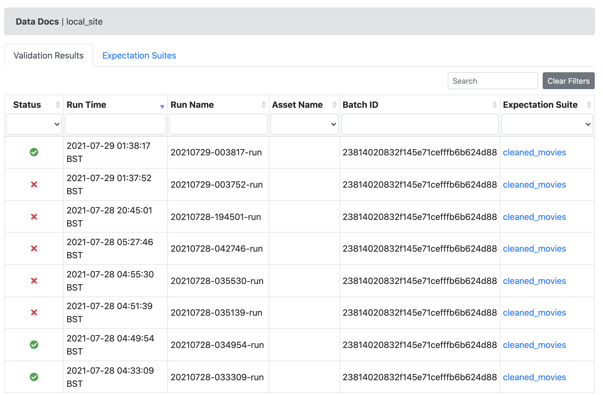
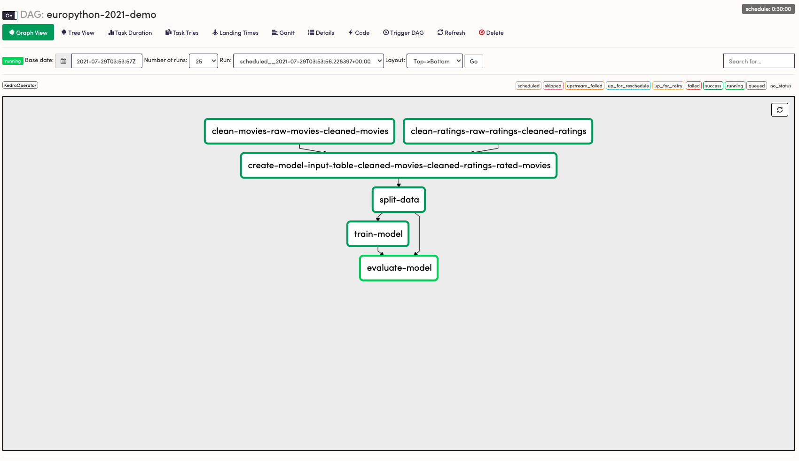
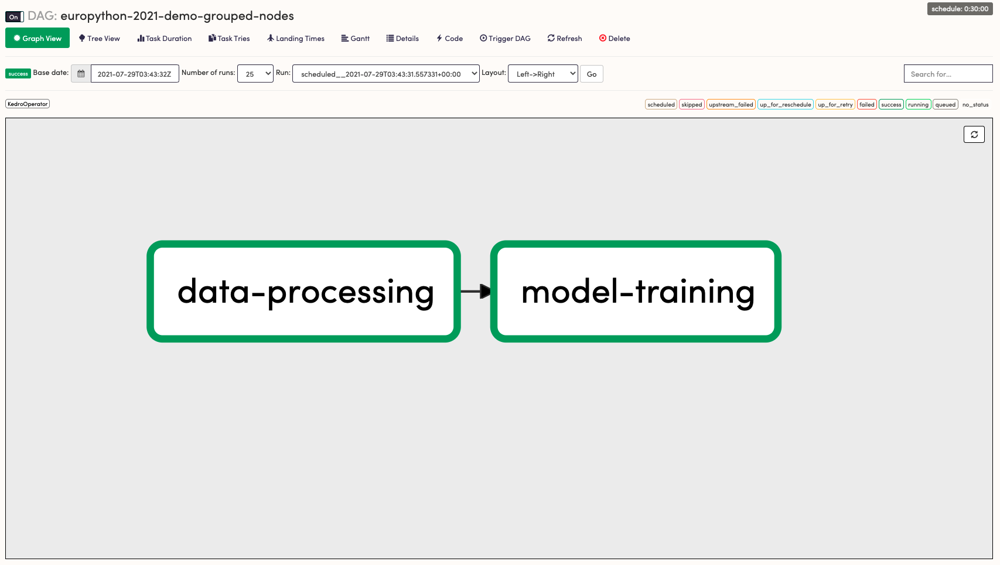

# EuroPython 2021 Demo Project

## Overview

This is the demo project for the talk [Reproducible and Deployable Data Science with Open-Source Python](https://ep2021.europython.eu/talks/6GJFyZM-reproducible-and-deployable-data-science-with-open-source-python/) at [EuroPython 2021](https://ep2021.europython.eu/). In a nutshell, it takes [a realistic Jupyter Notebook](https://github.com/microsoft/recommenders/blob/main/examples/02_model_collaborative_filtering/sar_deep_dive.ipynb) and related utilities, turns it into a Python project with [Kedro](https://kedro.readthedocs.io/en/latest/), deploys it to an [Airflow](https://airflow.apache.org/s) cluster and integrates [Great Expectations](https://docs.greatexpectations.io/en/latest/) as automated data quality checking.

## Useful Links

1. [Kedro Documentation](https://kedro.readthedocs.io/en/latest/)
2. [Great Expectations Documentation](https://docs.greatexpectations.io/en/latest/)
3. [Airflow Documentation](https://airflow.apache.org/docs/apache-airflow/stable/)
4. [Astronomer's guide to deploy Kedro pipeline with Airflow](https://www.astronomer.io/guides/airflow-kedro)
5. [Talk on Reproducible and maintainable data science code with Kedro by Yetunde Dada](https://www.youtube.com/watch?v=JLTYNPoK7nw) at PyCon US 2021.
6. [Microsoft Recommenders](https://github.com/microsoft/recommenders/)

## Installation

Create a new virtual environment, for example with `conda`:

```bash
conda create -n europython-2021-py37 python=3.7
```

Install the project's dependencies:

```bash
pip install -r src/dev_requirements.txt
```

## Run the pipeline

```bash
kedro run
```

## View the pipeline visualisation

```bash
kedro viz

# or `kedro viz --autoreload` if you want the visualisation to autoreload on file changes.
```

## Great-Expectations integration.

During a Kedro run, a data validation hook using Great Expectations will be called automatically for the `cleaned_movies` dataset. To view the data docs which shows the validation result, open `conf/base/great_expectations/uncommitted/data_docs/local_site/index.html`.



The design is simple: before a dataset is saved, if an expectation suite matching the dataset name exists, the dataset will be validated thanks to the `before_dataset_saved` hooks defined in [hooks.py](./src/hooks.py).

**Exercise**: add more expectation suites for other datasets in the project.

## Deployment with Airflow 

The airflow DAGs are located under `dags/`. The one called `europuython_2021_demo_dag.py` is automatically generated using [kedro-airflow](https://github.com/quantumblacklabs/kedro-airflow), which corresponds to the following deployment:



The other called `grouped_nodes_dag.py` is manually apdated from the original DAG to demonstrate the concept that you can deploy a Kedro pipeline with into a Kedro DAG with much lower granularity:



Install [Astronomer CLI](https://www.astronomer.io/docs/cloud/stable/develop/cli-quickstart) then run the following command:

```bash
kedro package
cp src/dist/*.whl ./
astro dev start
```

Open http://localhost:8080 to view the Airflow UI.

Read the deployment guide of a Kedro pipeline to Airflow using Astronomer guide [here](https://kedro.readthedocs.io/en/latest/10_deployment/11_airflow_astronomer.html) for more details.

## Running the test

```bash
pytest
```

**Exercise**: Currently there are only a few tests copied verbatim from the original notebook's utilities. Write more tests, especially integration tests, for the pipelines and setup a CI pipeline to run the test suite on every commit.
